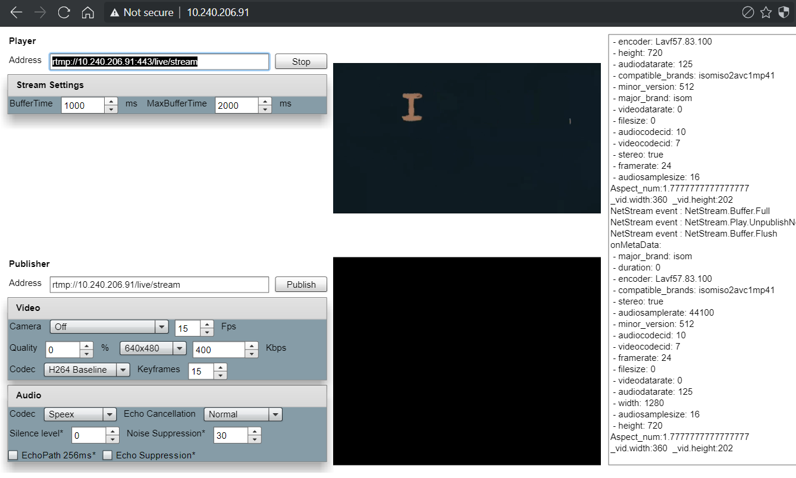
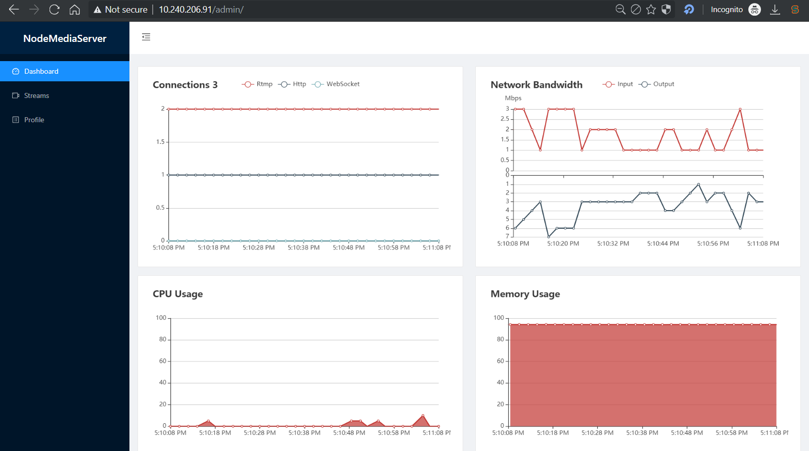

# Stream với Node Media Server (NMS)

A Node.js implementation of RTMP/HTTP-FLV/WS-FLV/HLS/DASH Media Server

1. [Tính năng](#1-tính-năng-chính)
2. [Cài đặt](#2-Cài-đặt)
3. [Sử dụng](#3-Sử-dụng-và-cấu-hình)

## 1. Tính năng chính

Các tính năng của NodeMedia:
- Cho phép theo dõi trạng thái Stream server
- Là RTMP/HTTP-FLV Stream Server
- Tích hợp xác thực khi publish hoặc play từ server

## 2. Cài đặt

Cài Nodejs bằng cách add PPA

Add PPA:

```bash
cd ~
curl -sL https://deb.nodesource.com/setup_10.x -o nodesource_setup.sh
bash nodesource_setup.sh
```

Cài nodejs:

```bash
apt update
apt install build-essential
apt install nodejs
```

Cài đặt Node Media Server:

```bash
cd ~
mkdir nms
cd nms
git clone https://github.com/illuspas/Node-Media-Server -b v2.1.0
npm i
npm audit fix
```

Run Node Media Server:

```bash
node app.js
```

## 3. Sử dụng và cấu hình

Sử dụng các tính năng và cách cấu hình

### 3.1. Cấu hình cơ bản cho NMS

Cấu hình cho NMS được đặt trong const `config` trong file `app.js`:

```console
const config = {
  rtmp: {
    port: 1935,
    chunk_size: 60000,
    gop_cache: true,
    ping: 30,
    ping_timeout: 60
  },
  http: {
    port: 8000,
    mediaroot: './media',
    webroot: './www',
    allow_origin: '*'
  },
  https: {
    port: 8443,
    key: './privatekey.pem',
    cert: './certificate.pem',
  },
  auth: {
    api: true,
    api_user: 'admin',
    api_pass: 'admin',
    play: false,
    publish: false,
    secret: 'nodemedia2017privatekey'
  },
};
```

Các tham số được ghi khá rõ ràng trong cấu hình, tuy nhiên lưu ý các tham số sau:
- `auth.api_user` và `auth.api_pass` là username và mật khẩu để truy nhập vào giao diện admin, theo dõi trạng thái của stream server (các thông số cpu, ram, network, connection hiện tại, các Stream đang có trên server)
- `auth.play`: yêu cầu thiết bị play stream phải xác thực với server
- `auth.publish`: yêu cầu thiết bị publish stream phải xác thực với server
- `auth.secret`: chuỗi mật được dùng để sinh ra chuỗi dùng để xác thực 

### 3.2. Play stream trên giao diện web

NMS cho phép truy cập để xem stream trực tiếp từ giao diện web. Người dùng truy cập trực tiếp vào địa chỉ của server (http hoặc https) để xem stream. Trên vùng "Player" Nhập địa chỉ của server đang publish stream để xem:

Ví dụ xem bằng RTMP:

```console
rtmp://10.240.206.91/live/stream
```




### 3.3. Theo dõi trạng thái của Stream server

Truy cập vào đường dẫn /admin và đăng nhập với tài khoản, mật khẩu ở trong `config.auth`




### 3.4. Xác thực khi publish hoặc play tới NMS

NMS hỗ trợ cơ chế xác thực khi publish hoặc play như sau:

Publish tạo một hash string bằng md5 

```console
"/live/stream-<expiration-time>-<secret>"
```

với:
- /live/stream là URI của publish stream.
- expiration-time là thời điểm mà stream hết hạn, được đặt ở dạng epoch
- secret là chuỗi mật trong config ở phần 3.1

Ví dụ stream: `/live/stream-1564692856-nodemedia2017privatekey` sinh ra chuỗi hash md5 `1564692856-b338ec548f98c6033001ea977e1313b5`

Truy vấn cần thực hiện (cả với thiết bị publish và play):

```bash
rtmp://IP:[port]/live/stream?sign=1564692856-b338ec548f98c6033001ea977e1313b5
```

nếu là http-flv:

```bash
http://IP:[port]/live/stream.flv?sign=1564692856-b338ec548f98c6033001ea977e1313b5
```

