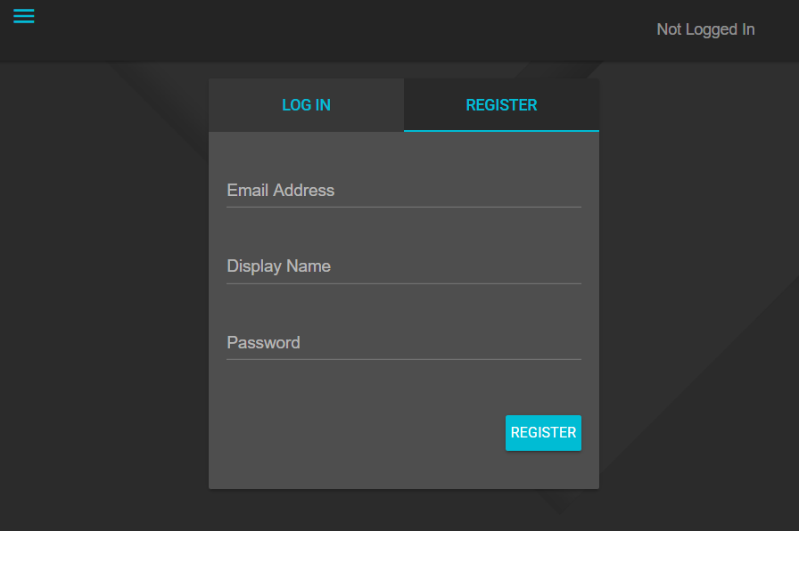
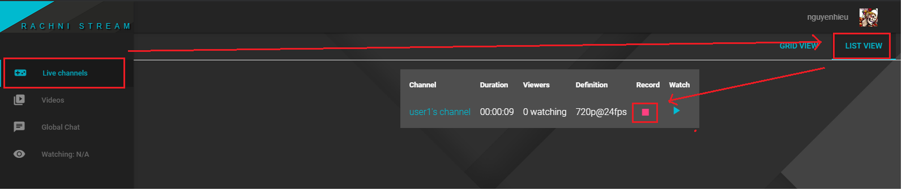
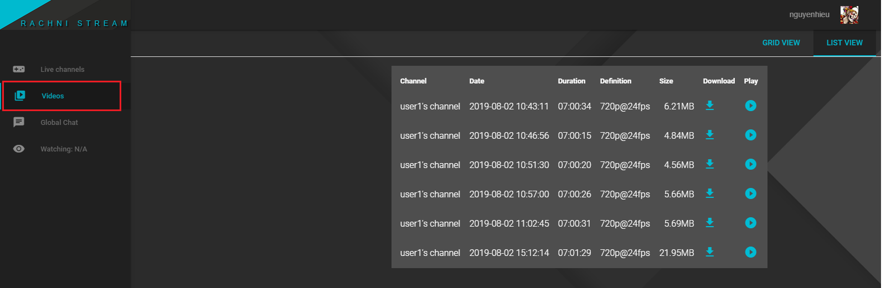

https://github.com/Fenrirthviti/stream-site
---

1. [Cài đặt](#1-Cài-đặt-Fenrirthviti's-stream-site)
2. [Tính năng](#2-Tính-năng-của-Fenrirthviti's-stream-site)

# 1. Cài đặt Fenrirthviti's stream site

Cài đặt thực hiện trên Ubuntu 18.04, người dùng root (cũng chạy trên Ubuntu 16).

Sử dụng [script cài đặt](./http-install.sh) hoặc thực hiện theo từng bước sau.

## 1.1. Compile nginx và modules

Cài đặt nginx với các module cần có [nginx-http-flv-module](https://github.com/winshining/nginx-http-flv-module), http-ssl-module và http_xslt_module.

Download mã nguồn của Nginx và nginx-http-flv-module:

```bash
wget http://nginx.org/download/nginx-1.16.0.tar.gz
wget https://github.com/winshining/nginx-http-flv-module/archive/v1.2.6.tar.gz
tar xvzf nginx-1.16.0.tar.gz
tar xvzf v1.2.6.tar.gz
```

Cài các gói để biên dịch:

```bash
apt update
DEBIAN_FRONTEND=noninteractive apt-get install -y \
 build-essential \
 libpcre3 libpcre3-dev libssl-dev \
 zlibc zlib1g zlib1g-dev \
 libxslt-dev
```

Compile Nginx:

```bash
cd nginx-1.16.0
./configure --prefix=/etc/nginx --user=nginx --group=nginx --sbin-path=/usr/sbin/nginx --conf-path=/etc/nginx/nginx.conf --error-log-path=/var/log/nginx/error.log --http-log-path=/var/log/nginx/access.log --pid-path=/var/run/nginx.pid --lock-path=/var/run/nginx.lock --with-http_ssl_module --add-dynamic-module=/root/nginx-http-flv-module-1.2.6 --with-http_xslt_module
make
make install
```

## 1.2. Cài Postgresql, PHP, ffmpeg

```
# install postgresql
apt -y install postgresql postgresql-contrib

# install ffmpeg
apt install -y ffmpeg

# install php
add-apt-repository ppa:ondrej/php -y
apt update
apt install -y php7.2 php7.2-pgsql php7.2-curl php7.2-xml php7.2-cgi php7.2-fpm
```

## 1.3. Cài Stream-site

Không sử dụng http để đơn giản hóa việc việc cài đặt:

```
cd ~
git clone https://github.com/hieunt79/stream-site -b http_install
```

Setup database, giả sử người dùng và database sử dụng là `test`, password là `secret`

```bash
# DB information
DB_NAME=test
USER_DB=test
PASSWD_DB=secret

# setup database
sudo -u postgres createuser test
sudo -u postgres createdb test
cp -r stream-site/src/pgsql/* /tmp
cd /tmp
sed -i s/pg_sql_account_here/$USER_DB/g users.sql
sed -i s/pg_sql_account_here/$USER_DB/g subscribers.sql
sed -i s/pg_sql_account_here/$USER_DB/g chat.sql

cat > owner.sql << EOF
alter user $USER_DB with encrypted password '$PASSWD_DB';
grant all privileges on database $DB_NAME to $USER_DB; 
EOF

sudo -u postgres psql -f owner.sql
sudo -u postgres psql -d test -f users.sql
sudo -u postgres psql -d test -f subscribers.sql
sudo -u postgres psql -d test -f chat.sql
```

Config database

```bash
cd ~/stream-site
sed -i s/USER_DB/$USER_DB/g lib/database.class.php
sed -i s/PASSWD_DB/$PASSWD_DB/g lib/database.class.php
sed -i s/DB_NAME/$DB_NAME/g lib/database.class.php
```

Cấu hình Nginx và content

```bash
# add user nginx
useradd -s /sbin/nologin nginx

# add necessary folder
mkdir /var/log/rachni
mkdir -p /var/rachni/rec
chown -R nginx.nginx /var/log/rachni
chown -R nginx.nginx /var/rachni/rec

# copy file to var/www/html
cd ~/stream-site
mkdir -p /var/www/html
cp -r * /var/www/html
rm -rf /var/www/html/src
rm -rf /var/www/html/scss
mkdir -p /var/www/html/img/video
mkdir -p /var/www/html/img/channel
mkdir -p /var/www/html/img/thumbs
chown -R nginx.nginx /var/www/html

# nginx config
cp -R src/nginx/* /etc/nginx
chmod +x /etc/nginx/conf.d/*.sh
cd /etc/nginx
sed -i '1s/^/load_module \/etc\/nginx\/modules\/ngx_http_flv_live_module.so;\n/' /etc/nginx/nginx.conf
echo "error_log /var/log/nginx/error.log debug;" >> /etc/nginx/nginx.conf
sed -i 's/path\/to/etc\/nginx\/conf.d/g' /etc/nginx/conf.d/rtmp.conf
mkdir sites-enabled
cd sites-enabled
ln -s ../sites-available/main.conf main.conf
chown -R nginx.nginx /etc/nginx/*
```

Tạo systemd service cho Nginx

```bash
cat > /lib/systemd/system/nginx.service << EOF
[Unit]
Description=The Nginx 1.15.8 service
After=syslog.target network.target remote-fs.target nss-lookup.target

[Service]
Type=forking
PIDFile=/usr/local/nginx/logs/nginx.pid
ExecStartPre=/usr/sbin/nginx -t
ExecStart=/usr/sbin/nginx
ExecReload=/usr/sbin/nginx -s reload
ExecStop=/bin/kill -s QUIT \$MAINPID
PrivateTmp=true

[Install]
WantedBy=multi-user.target
EOF
systemctl daemon-reload
systemctl start nginx
```

<!-- Config php-fpm to run php with nginx: -->
Cấu hình php-fpm để chạy php với Nginx:

```bash
sed -i s/www-data/nginx/g /etc/php/7.2/fpm/pool.d/www.conf
sed -i s/cgi.fix_pathinfo=1/cgi.fix_pathinfo=0/g /etc/php/7.2/fpm/php.ini
systemctl restart php7.2-fpm
```

Vào địa chỉ IP của host cài đặt để truy cập vào dịch vụ

# 2. Tính năng của Fenrirthviti's stream site

- Quản lý người dùng: cho phép người dùng đăng ký bằng và verify bằng email. Cho phép reset password
- Stream với key: mỗi người dùng được cấp key, khi stream tới server phải có tài khoản và key tương ứng
- Record: Mọi người đều có thể thu một đoạn stream để phát lại sau
- Playback: Mọi người đều có thể phát lại hoặc down xuống bản thu đã lưu
- Stream API: 

## 2.1. Quản lý người dùng

Chức năng quản lý người dùng cần cấu hình thêm mail. Để tập trung vào chức năng chính của công cụ, tạm thời bỏ qua việc cấu hình mail, sửa database thủ công để kích hoạt người dùng.

Hiện tại người dùng có thể được thêm vào hệ thống theo cách sau:
- Người dùng nhập các thông tin cần thiết ở cửa sổ đăng ký.



- Người quản trị truy cập vào CLI của DB để cập nhật trường xác thực người dùng (`verified = 1`)
- Nếu là account admin cập nhật trường `is_admin = true`

```
update users set verified = 1, is_admin = true where email = <user-mail>;
```

- Từ đây người dùng có thể đăng nhập bình thường, với admin thì hiển thị thêm panel quản lý thông tin của các account


## 2.2. Stream với key

Để stream tới Stream-site, người stream cần phải có một key tương ứng với tài khoản của mình thì mới được chấp nhận. Hiện tại việc thêm `stream_key` được add thủ công vào database. Cú pháp để stream tới như sau:

```
rtmp://IP/live/<user_display_name>?key=<stream_key>
``` 

Ví dụ stream với ffmpeg:

```
ffmpeg -re -i clip.mp4 -c:v libx264 -c:a aac -ar 44100 -strict -2 -preset superfast -tune zerolatency -f flv rtmp://127.0.0.1/live/user1?key=user1stkey
```

NOTE: Người dùng khi xem stream phải có trường `api_key` có dữ liệu. Cũng cần add thủ công vào DB.

## 2.3. Record & Playback

Công cụ cho phép record stream và phát lại:

Record



Playback



## 2.4. API

[API docs](https://github.com/Fenrirthviti/stream-site/tree/master/api)
